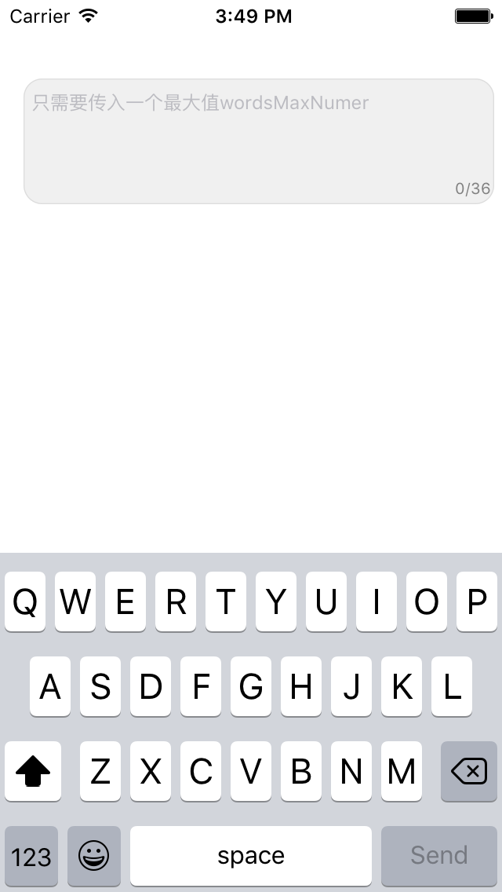
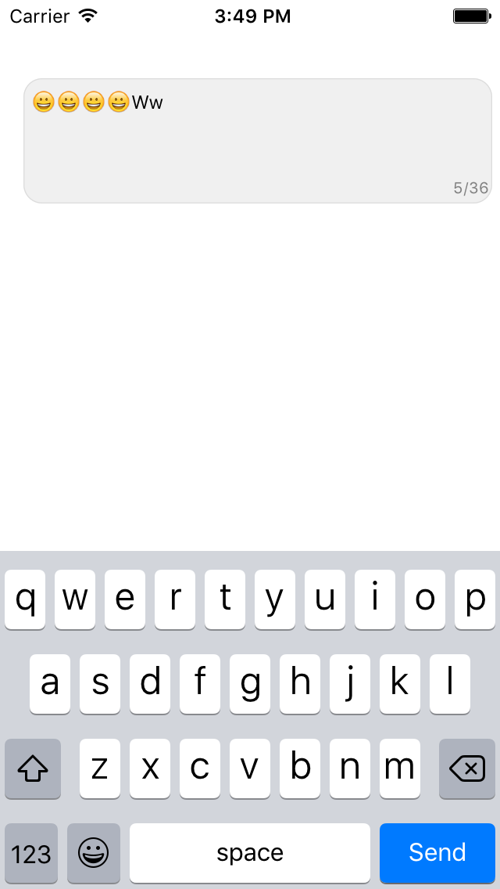

# NumberTextView
===============

+ 右下角的带数字提醒的UITextView，类似新浪微博140字以内的（只需要传入一个wordsMaxNumer），默认显示

+ 一个类似UITextField的placeHolder的类别

+ 用[ReactiveCocoa](https://github.com/ReactiveCocoa/ReactiveCocoa)监听UITextView的状态，避免了一个键盘是联想输入的时候不走代理方法的问题

+ emoji表情算一个汉字，2个英文算一个汉字的处理方法计算的长度

===============

 

===============

感谢
